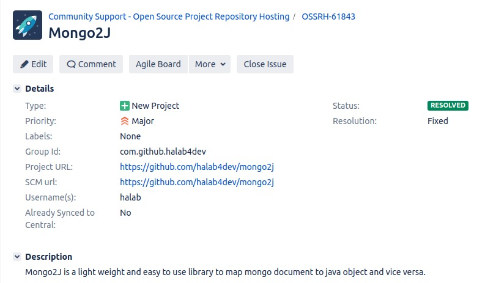
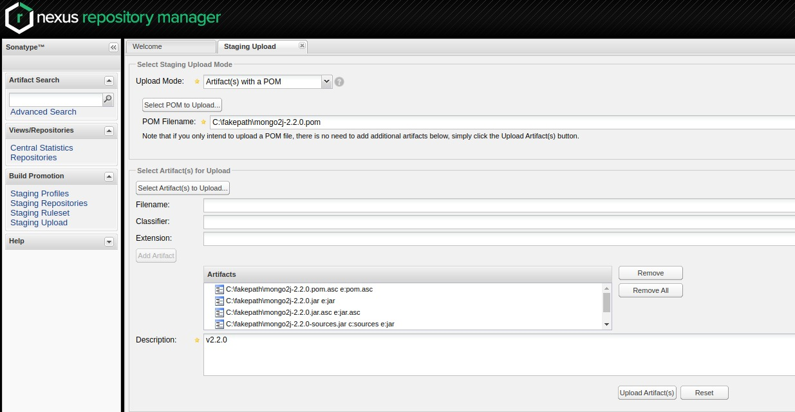

Ngày xưa import các thư viện của người khác từ maven về dùng cảm thấy họ pro vãi chưởng.
Ấy thế mà giờ mình cũng vừa public 1 thư viện lên trên này, 
mặc dù code cũng bình thường, phục vụ dự án là chính, 
nhưng mà thấy oai như cóc =))

Để đánh dấu cái cột mốc này + note lại các bước để public lên maven 
thì tất nhiên là phải viết 1 bài rồi 😄

---
#### 1. Project requirement
Bước này chủ yếu là thao tác với file `pom.xml` thôi, để đảm bảo:
- Thư viện cung cấp source và javadoc
- Các thông tin cần thiết khác: Project name, description, thông tin developer ...

Thêm các plugin sau để tự generate source và javaodoc khi build bằng maven:
```xml
    <build>
        <plugins>
            <plugin>
                <groupId>org.apache.maven.plugins</groupId>
                <artifactId>maven-source-plugin</artifactId>
                <version>3.2.0</version>
                <executions>
                    <execution>
                        <id>attach-sources</id>
                        <goals>
                            <goal>jar-no-fork</goal>
                        </goals>
                    </execution>
                </executions>
            </plugin>
            <plugin>
                <groupId>org.apache.maven.plugins</groupId>
                <artifactId>maven-javadoc-plugin</artifactId>
                <version>3.2.0</version>
                <executions>
                    <execution>
                        <id>attach-javadocs</id>
                        <goals>
                            <goal>jar</goal>
                        </goals>
                    </execution>
                </executions>
            </plugin>
            ...
        </plugins>
    </build>
```
Thêm các thông tin khác nữa:
```xml
    <groupId>com.github.halab4dev</groupId>
    <artifactId>mongo2j</artifactId>
    <version>2.2.0</version>

    <!--    META DATA   -->
    <name>Mongo2J</name>
    <description>Mongo2J is a light weight and easy to use library to map mongo document to java object and vice
        versa.
    </description>
    <url>https://github.com/halab4dev/mongo2j</url>

    <licenses>
        <license>
            <name>MIT License</name>
            <url>http://www.opensource.org/licenses/mit-license.php</url>
        </license>
    </licenses>

    <developers>
        <developer>
            <name>Luong Ai Bao Ha</name>
            <email>halab4it@gmail.com</email>
            <roles>
                <role>Author</role>
            </roles>
        </developer>
    </developers>

    <scm>
        <connection>scm:git:git://github.com/halab4dev/mongo2j.git</connection>
        <developerConnection>scm:git:ssh://github.com:halab4dev/mongo2j.git</developerConnection>
        <url>https://github.com/halab4dev/mongo2j</url>
    </scm>
    <!--    END OF META DATA   -->
```
#### 2. Chuẩn bị key PGP
Để có thể public lên Central Repository thì các file cần phản được "sign" bằng PGP (không biết dịch từ sign thế nào nữa).
- Cài đặt PGP qua package manager hoặc download từ [trang chủ](https://www.gnupg.org/download/)
- Tạo key mới (chọn RSA và 2048bit, các cái khác thì tuỳ)

```shell
$ gpg2 --gen-key
```
Note: cái đoạn tạo key này chả hiểu chạy kiểu gì, nhưng nếu thấy lâu thì có thể chạy lệnh sau ở 1 cửa sổ terminal khác nhé

```shell
$ sudo find / -type f | xargs grep somerandomstring > /dev/null
```

- List key

```shell
gpg2 --list-keys

/home/juven/.gnupg/pubring.gpg
------------------------------
pub   1024D/C6EED57A 2010-01-13
uid                  Juven Xu (Juven Xu works at Sonatype) <juven@sonatype.com>
sub   2048g/D704745C 2010-01-13
```

- Distribute public key lên các keys server

```shell
gpg2 --keyserver hkp://pool.sks-keyservers.net --send-keys C6EED57A
```

- Thêm đoạn sau vào file `pom.xml`

```xml
<build>
    <plugins>
        ...
        <plugin>
            <groupId>org.apache.maven.plugins</groupId>
            <artifactId>maven-gpg-plugin</artifactId>
            <version>1.6</version>
            <executions>
                <execution>
                    <id>sign-artifacts</id>
                    <phase>verify</phase>
                    <goals>
                        <goal>sign</goal>
                    </goals>
                    <configuration>
                        <executable>gpg2</executable>
                    </configuration>
                </execution>
            </executions>
        </plugin>
        ...
    </plugin>
</build>
```

#### 3. Tạo ticket yêu cầu tạo project mới trên maven central
Khá là loằng ngoằng, nhưng đại ý là cần thông qua 1 thằng tên là sonartype để public lên maven central

- Register tài khoản trên trang [sonartype](https://issues.sonatype.org/secure/Signup!default.jspa).
- Tạo ticket mới và điền các thông tin được yêu cầu. (Có thể tham khảo [ticket của mình](https://issues.sonatype.org/browse/OSSRH-61843))



Không rõ là người hay máy nữa, nhưng phản hồi khá nhanh, 
đầu tiên họ sẽ yêu cầu mình xác thực domain mà mình đăng ký ở file `pom`, cái `groupId` ý.
Case của mình là dùng github nên sẽ được yêu cầu tạo 1 project có tên XXX, 
sau khi tạo xong thì comment lại để họ kiểm tra. 
Nếu mọi thứ OK thì ta có thể bắt đầu việc public lên maven rồi

#### 4. Thêm các thông tin để có thể public lên repository của sonartype
Thêm thông tin account sonartype vào file setting của maven (`~/.m2/setting.xml`):
```xml
<settings>
  <servers>
    <server>
      <id>ossrh</id>
      <username>{SONARTYPE_USERNAME}</username>
      <password>{SONARTYPE_PASSWORD}</password>
    </server>
  </servers>
</settings>
```

Thêm cả 2 đoạn sau vào file `pom.xml` nữa


```xml
<distributionManagement>
    <snapshotRepository>
        <id>ossrh</id>
        <url>https://oss.sonatype.org/content/repositories/snapshots</url>
    </snapshotRepository>
    <repository>
        <id>ossrh</id>
        <url>https://oss.sonatype.org/service/local/staging/deploy/maven2/</url>
    </repository>
</distributionManagement>
<build>
    <plugins>
        ...
        <plugin>
            <groupId>org.sonatype.plugins</groupId>
            <artifactId>nexus-staging-maven-plugin</artifactId>
            <version>1.6.7</version>
            <extensions>true</extensions>
            <configuration>
                <serverId>ossrh</serverId>
                <nexusUrl>https://oss.sonatype.org/</nexusUrl>
                <autoReleaseAfterClose>true</autoReleaseAfterClose>
            </configuration>
        </plugin>
        ...
    </plugins>
</build>
```
#### 5. Public bản SNAPSHOT
```shell
$ mvn clean deploy
```

#### 6. Public bản staging và bản chính thức
```shell
$ mvn clean package
```
Trong quá trình build thì nó sẽ có popup hỏi password của key tạo ở step 2, nhập vào là OK.
Khi build xong thì trong thư mục `target`, ngoài file jar thông thường, 
sẽ có thêm các file source, javadoc, mỗi loại sẽ có thêm 1 file `.asc` nữa.

Sau khi build xong thì đăng nhập vào trang [Nexus Reposotiry Manager](https://oss.sonatype.org/) bằng account sonar type, vào mục [Staging Upload](https://oss.sonatype.org/#staging-upload), 
chọn các file vừa build ra xong (pom, jar, javadoc, source, các file .asc)


Upload xog thì sẽ phải đợi 1 chút để scan, check gì đó. 
Nếu không có vấn đề gì thì trạng thái sẽ chuyển thành closed.
Lúc này thì chỉ cần bấm nút release là xong.
À, ở lần đầu tiên thì nhớ comment lại trên ticket là tôi đã upload first release nhé, 
hệ thống sẽ kích hoạt đồng bộ lên maven central. 

Bình thường thì sẽ mất khoảng vài tiếng để có thể cập nhật lên maven central (để search đc ra ý), 
còn khoảng sau 10 phút là có thể import dependency thư viện của mình vào file pom rồi.

Done, cũng không phức tạp lắm nhỉ 

Refrences:
- [https://central.sonatype.org/](https://central.sonatype.org/pages/producers.html)